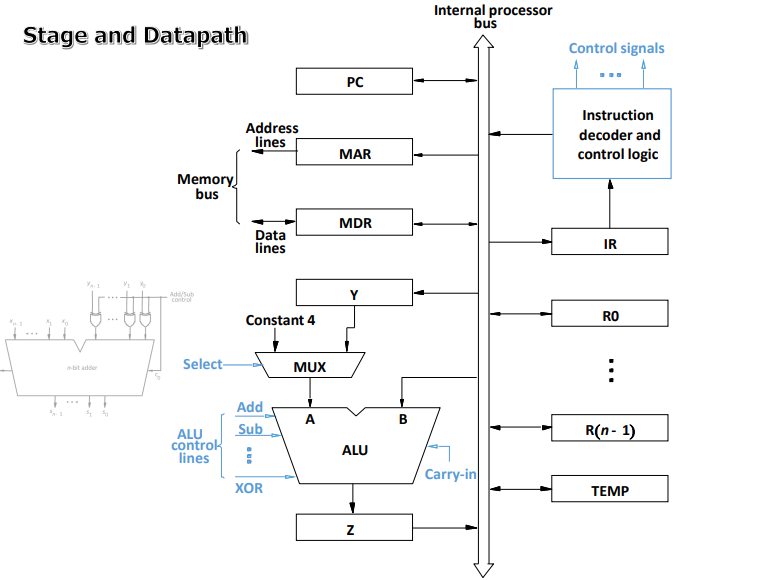

# Final Mini Project: SAP-1 Implementation in Verilog

## Project Overview

This project implements a simplified SAP-1 (Simple-As-Possible-1) computer architecture using Verilog. The design is an 8‑bit, single‑bus, hardwired system with a 16‑byte memory. It is capable of executing basic load, arithmetic, store, and move operations.

The following data flow diagram illustrates the interconnection between components:



> **Note:** Place your own `DataPath.png` in the same folder as this report. The diagram should show the single bus and how the PC, MAR, IR, A, B, ALU, and memory are connected.

---

## Role of Each Component 

| Component | Symbol | Description |
|-----------|--------|-------------|
| **Program Counter (PC)** | `PC` | 4‑bit register that holds the address of the next instruction. It can be incremented, loaded with a new value, or output onto the bus. |
| **Memory Address Register (MAR)** | `MAR` | 4‑bit register that holds the address to be read from or written to memory. Its input comes from the bus; its output goes directly to the memory address lines. |
| **Instruction Register (IR)** | `IR` | 8‑bit register that stores the current instruction. The high nibble (bits 7‑4) is the opcode; the low nibble (bits 3‑0) is the address or immediate value. |
| **Memory (RAM)** | `MEMORY` | 16×8 memory array. It is read or written when `MEM_rd` or `MEM_wr` is asserted. The address comes from `MAR`. |
| **A Register** | `A` | 8‑bit register that holds one operand for ALU operations and also stores the result. |
| **B Register** | `B` | 8‑bit register that holds the second operand for ALU operations. |
| **Arithmetic Logic Unit (ALU)** | `ALU` | Performs operations (add, subtract, etc.) on the A and B registers. The operation is selected by the 2‑bit `ALU_op` signal. |
| **Control Unit** | `CU` | Hardwired state machine that generates all control signals based on the current opcode and timing state (T0, T1, T2, …). |
| **Bus** | `BUS` | 8‑bit tri‑state bus that connects all registers and memory for data transfer. Only one component drives the bus at any time. |

> **Important:** Only two general‑purpose registers (A and B) are available. All operations use A and/or B.

---

## Instruction Set & Opcode Format

The instruction register (`IR`) is split as follows:

```
IR[7:4]   IR[3:0]
 Opcode    Address/Immediate 
```
              opcode value
**Example** : 0011   0001 
-> Add A with 1 and place the result into A

```
Similar to 
    ADD A, 1
```
> You can see opcode signal below

### Defined Opcodes

| Mnemonic | Opcode (4‑bit) | Operation | Description |
|----------|----------------|-----------|-------------|
| `LDA`    | `0000` | `A ← MEM[addr]` | Load A from memory |
| `ADD`    | `0001` | `A ← A + MEM[addr]` | Add memory to A |
| `SUB`    | `0010` | `A ← A - MEM[addr]` | Subtract memory from A |
| `ADDI`   | `0011` | `A ← A + imm` | Add immediate to A |
| `SUBI`   | `0100` | `A ← A - imm` | Subtract immediate from A |
| `STRA`   | `0101` | `MEM[addr] ← A` | Store A to memory |
| `MOVAB`  | `0110` | `B ← A` | Copy A to B |
| `LDB`    | `1000` | `B ← MEM[addr]` | Load B from memory |
| `ADDB`   | `1001` | `B ← B + MEM[addr]` | Add memory to B |
| `SUBB`   | `1010` | `B ← B - MEM[addr]` | Subtract memory from B |
| `ADDBI`  | `1011` | `B ← B + imm` | Add immediate to B |
| `SUBBI`  | `1100` | `B ← B - imm` | Subtract immediate from B |
| `STRB`   | `1101` | `MEM[addr] ← B` | Store B to memory |
| `MOVBA`  | `1110` | `A ← B` | Copy B to A |

---

## Control Signals – Detailed Description

The control unit produces the following signals (active‑high unless noted):

| Signal | Width | Description |
|--------|-------|-------------|
| `PC_out` | 1 | Enables PC to drive the bus |
| `PC_in`  | 1 | Loads the bus value into PC |
| `PC_inc` | 1 | Increments PC by 1 (no bus involvement) |
| `MAR_in` | 1 | Loads bus value into MAR |
| `MEM_rd` | 1 | Reads memory at address MAR onto the bus |
| `MEM_wr` | 1 | Writes bus value into memory at address MAR |
| `IR_in`  | 1 | Loads bus value into IR (only during fetch) |
| `IR_out` | 1 | Enables IR to drive the bus (useful for immediate operands) |
| `A_in`   | 1 | Loads bus value into A register |
| `B_in`   | 1 | Loads bus value into B register |
| `ALU_out`| 1 | Enables ALU result onto the bus |
| `ALU_op` | 2 | Selects ALU function: `00` = A + B, `01` = A - B |
| `state` | 4 | Current timing

> **Design simplification:** Most designs hardwire ALU inputs to A and B registers. The ALU result must be stored via a register (A or B) before it can be used again.

---

## Microinstruction Sequence (Timing Steps)

The control unit uses a simple state counter (T0, T1, T2, …) that cycles through each instruction. Below is the exact sequence for the two required instructions: **LDA 3** and **ADD 6**.

### Common Fetch Cycle – Same for Every Instruction

| Timing | Control Signals Active | Action |
|--------|------------------------|--------|
| **T0** | `PC_out`, `MAR_in` | Copy PC → MAR |
| **T1** | `PC_inc`, `MEM_rd`, `IR_in` | Increment PC, read memory at MAR into IR |
| **T2** | (depends on opcode) | Execute cycle begins |

After T2, the machine returns to T0 for the next instruction.

### Instruction: `LDA 3` – Opcode `0000`, Address `0011` (3)

Assume memory[3] contains `0x45` (example value).

| Timing | Control Signals Active | Data Transfer / Action |
|--------|------------------------|------------------------|
| **T2** | `IR_out[3:0]`, `MAR_in` | Extract address from IR (bits 3‑0) and load into MAR |
| **T3** | `MEM_rd`, `A_in` | Read memory at address 3, place result on bus, write to A |

Now A = `0x45`.

### Instruction: `ADD 6` – Opcode `0001`, Address `0011` (6)

Assume memory[6] contains `0x12`. A currently holds `0x45` from previous step.

| Timing | Control Signals Active | Data Transfer / Action |
|--------|------------------------|------------------------|
| **T2** | `IR_out[3:0]`, `MAR_in` | Extract address 6 and load into MAR |
| **T3** | `MEM_rd`, `B_in` | Read memory[6] into B register (B = `0x12`) |
| **T4** | `ALU_op = 00` (A+B), `ALU_out`, `A_in` | ALU adds A and B, result (0x57) is written back to A |

After T4, A contains the sum. The next fetch cycle begins at T0.

> **Why this sequence?** The ALU can only compute A ± B. Therefore we must first load the memory operand into B, then perform the addition. This two‑step execute phase is typical for single‑bus SAP‑1 designs.

### Additional Instruction Examples (for completeness)

**`MOVAB`** (copy A to B)  
- T2: `A_out` (enable A on bus), `B_in` → B gets A’s value.

**`ADDI #5`** (add immediate 5 to A)  
- T2: `IR_out[3:0]` (zero‑extended), `B_in` → move immediate to B  
- T3: `ALU_op=00`, `ALU_out`, `A_in` → A = A + immediate.

---

## Expected Simulation Waveforms

Include screenshots from Vivado simulation that clearly show:

1. **The entire fetch‑execute cycle** for `LDA 3` followed by `ADD 6`.
2. **Key signals**: `clk`, `reset`, `Tstate` (T0, T1, …), `PC`, `MAR`, `IR`, `MEM_rd`, `MEM_wr`, `A`, `B`, `ALU_out`, and the bus.

An example waveform annotation:

```
clk     __|~~|__|~~|__|~~|__
Tstate   T0  T1  T2  T3  T0 ...
PC       0   1   2   2   3 ...
MAR      0   1   3   3   6 ...
IR       xx  0x3A xx  xx  0x16... (first instr LDA 3)
A        xx  xx  xx  0x45 0x45 ... (after LDA)
...
```

## Running the Testbench

The testbench should:
- Load the following machine code into memory at addresses 0, 1, …:
  ```
  Address 0: 8'b0000_0011   // LDA 3
  Address 1: 8'b0001_0110   // ADD 6
  Address others: 8'b0000_0000
  ```
- Initialize memory[3] = 0x45, memory[6] = 0x12.
- Apply reset, then run for enough clock cycles to fetch and execute both instructions.
- Monitor the waveform and check that A ends up as 0x57.

For random testing, the testbench can:
- Write different values into memory.
- Run sequences of `LDA`, `ADD`, `ADDI`, `MOVAB`, etc.
- Verify final register values against a software model.

---

## ARM Equivalent (for reference)

The given assembly instructions correspond to ARM as:

```asm
LDR A, [3]     ; load A from memory address 3
ADD A, [6]     ; add memory[6] to A
```

In our SAP‑1, `LDA 3` performs `A ← MEM[3]`, and `ADD 6` performs `A ← A + MEM[6]`.

Understood. Instead of listing only the control signals **from** the control unit, you want a complete list of **all data, address, and signal paths** that travel across the system – including where they come from (source module) and where they go (destination module), along with their role. No need to repeat the control signal list from earlier.

Here is the **inter‑module data/address/signal flow** in the SAP‑1:

---

## 1. Bus Signals (8‑bit wide)

The **system bus** is a shared 8‑bit bidirectional path. Only one module drives it at a time. The following items are placed onto the bus by various modules under control of enable signals.

| Signal / Data | Source Module | Destination Module(s) | Role & Description |
|---------------|---------------|----------------------|---------------------|
| **PC value** (4 bits zero‑extended to 8) | Program Counter (PC) | MAR, (bus listeners like testbench) | During T0 of fetch, the current instruction address is sent via bus to MAR. |
| **Memory read data** (8 bits) | Memory (RAM) | IR, A, B, or any register | When `MEM_rd` is active, memory drives the bus with the contents at address MAR. |
| **Instruction / Immediate** (8 bits) | Instruction Register (IR) | MAR (lower 4 bits), B register (full 8 or zero‑extended) | During execute phase, the address or immediate value embedded in IR is sent to MAR or to B. |
| **ALU result** (8 bits) | ALU | A register, B register, or memory | After an ALU operation, the result is placed on the bus and then loaded into a destination register (usually A). |

> **Note:** A and B registers **never drive the bus directly** – they only load from the bus. Their outputs go only to the ALU inputs.

---

## 2. Point‑to‑Point Signals (Not on Bus)

These signals travel directly between modules without using the shared bus.

| Signal / Data | Source Module | Destination Module | Role & Description |
|---------------|---------------|--------------------|---------------------|
| **PC increment** (internal) | Control unit | PC | A dedicated `PC_inc` line tells PC to add 1 to its value. Not a data value, just a control pulse. |
| **MAR address** (4 bits) | MAR | Memory (RAM) | The address lines from MAR to memory are direct. Not bus‑based. Used for every read or write. |
| **A register value** (8 bits) | A register | ALU (input A) | Hardwired connection; A supplies one operand to ALU. |
| **B register value** (8 bits) | B register | ALU (input B) | Hardwired connection; B supplies the second operand to ALU. |
| **Opcode** (4 bits) | IR (bits 7‑4) | Control unit | Direct connection; control unit reads the opcode to decide which signals to assert in execute phase. |
| **Clock** (1 bit) | External oscillator / testbench | All sequential modules (PC, MAR, IR, A, B, memory if synchronous) | Global clock edge triggers all register loads and updates. |
| **Reset** (1 bit) | External / testbench | PC, control unit state machine, optionally others | Initializes PC to 0, resets control unit to T0. |

---

## 3. Memory‑Specific Signals

These are internal to the memory module but worth listing as they are part of system data flow.

| Signal / Data | Source | Destination | Role |
|---------------|--------|-------------|------|
| **Address input** (4 bits) | MAR (always) | Memory internal address decoder | Selects which of the 16 bytes to read/write. |
| **Write data** (8 bits) | Bus | Memory internal storage | When `MEM_wr` is active, memory takes bus value and writes it to selected address. |
| **Read data** (8 bits) | Memory internal storage | Bus | When `MEM_rd` is active, memory drives bus with data from selected address. |

---

## 4. Control Unit to Module Signals (Already detailed earlier, but for completeness)

These are dedicated lines from control unit to each module; they are not shared on the bus.

| Signal | Source | Destination(s) | Role (short) |
|--------|--------|----------------|--------------|
| `PC_inc` | Control unit | PC | Increment PC |
| `PC_in` | Control unit | PC | Load PC from bus |
| `PC_out` | Control unit | PC (enable) | Enable PC to drive bus |
| `MAR_in` | Control unit | MAR | Load MAR from bus |
| `IR_in` | Control unit | IR | Load IR from bus |
| `IR_out` | Control unit | IR (enable) | Enable IR to drive bus |
| `A_in` | Control unit | A register | Load A from bus |
| `B_in` | Control unit | B register | Load B from bus |
| `ALU_op[1:0]` | Control unit | ALU | Select ALU function |
| `ALU_out` | Control unit | ALU (enable) | Enable ALU to drive bus |
| `MEM_rd` | Control unit | Memory | Enable memory read onto bus |
| `MEM_wr` | Control unit | Memory | Write bus value to memory |

---

## 5. Example Data Flow for `LDA 3` (Concrete Walk)
> this is not a final version, just for understanding 

| Step | Data/Address traveling | Source → Destination | Role |
|------|------------------------|----------------------|------|
| T0 | PC value (0) | PC → bus → MAR | Send instruction address to MAR |
| T1 | Memory data at addr 0 (instruction `0x03`) | Memory → bus → IR | Fetch instruction into IR |
| T1 | PC increment (0→1) | PC (internal) | No bus; PC increments |
| T2 | Address field (3) from IR | IR → bus → MAR | Get operand address from IR, load into MAR |
| T3 | Memory data at addr 3 (value `0x45`) | Memory → bus → A | Load that value into A |
---


